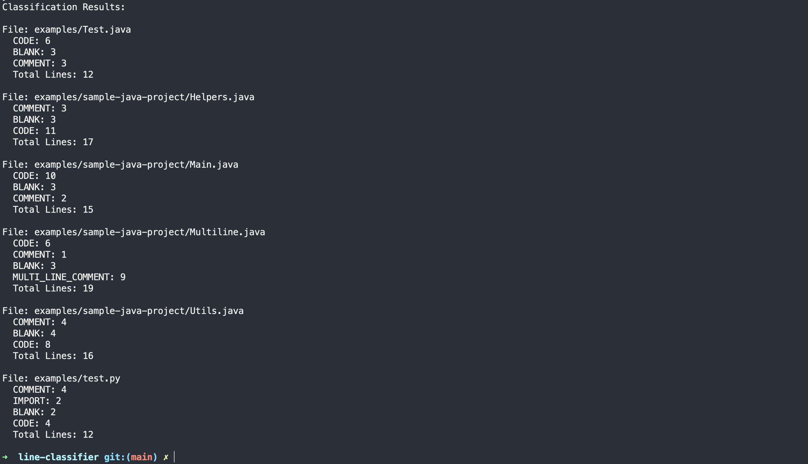

# Line Classification Engine

A simple Node.js-based line classification engine that can classify lines of code based on predefined rules, including multi-line comments, single-line comments, and other code types.

## Features

- Classifies Java code lines, including:
    - Single-line comments
    - Multi-line comments
    - Other code types like imports and executable lines
- Supports multiple languages (e.g., Java, Python, etc.)
- Easily extensible for adding more classifiers
- CLI-based tool to classify code files or entire directories

## Prerequisites

- Node.js version 20 or higher
- npm (Node Package Manager)

## Installation

1. Clone this repository:

    ```bash
    git clone <repository_url>
    cd <repository_folder>
    ```

2. Install the dependencies:
    ```bash
    npm install
    ```

## Running the Project

To classify a file or folder of code, you can use the provided `npm run classify` command.

### Command

```bash
npm run classify <file/folder path>
```

- <file/folder path>: The path to a file or folder containing code you want to classify. If a folder is provided, all files within the folder will be classified.

### Example usage:

To classify a single Java file:

```bash
npm run classify examples/Test.java
```

To classify a Python file:

```bash
npm run classify examples/test.py
```

To classify all Java files within the examples folder:

```bash
npm run classify examples/sample-java-example
```

To classify all files in the examples directory:

```bash
npm run classify examples
```

### Sample Response

```bash
npm run classify examples
```


